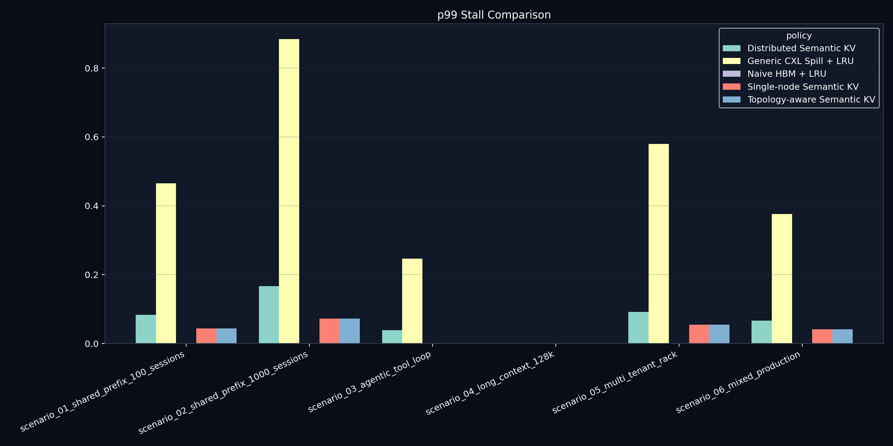
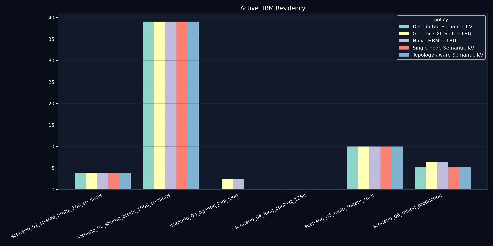

# Semantic KV Control Plane

[](https://github.com/manishklach/semantic-kv-control-plane/actions/workflows/ci.yml)
[](https://github.com/manishklach/semantic-kv-control-plane/actions/workflows/ci.yml)
[](https://www.python.org/downloads/)
[](LICENSE)
[](https://colab.research.google.com/github/manishklach/semantic-kv-control-plane/blob/main/examples/quickstart.ipynb)

A systems research platform for semantic KV-cache orchestration, topology-aware memory placement, distributed prefix reuse, and rack-scale inference memory simulation.

## 30-second Summary

This repo explores what happens when KV cache stops looking like a runtime detail and starts looking like distributed infrastructure. It simulates metadata-aware KV placement across GPU HBM, KV appliances, CXL-style pools, and persistent tiers, then compares policy choices under synthetic but reproducible workloads. The goal is not to beat real serving systems on paper; the goal is to study the memory-orchestration layer around them.

> [!IMPORTANT]
> **What this is NOT**
>
> - not a real GPU runtime
> - not vLLM integration
> - not CUDA execution
> - not a hardware benchmark
> - not embedding-based semantic search

> **"CXL exposes memory. A KV infrastructure layer should expose intent."**

## Why This Exists

Inference serving is getting more memory-bound as context windows grow, shared prompts get larger, and agentic loops keep state alive across many decode steps. KV cache footprints grow quickly, HBM remains scarce, and simple spill behavior often treats all KV as anonymous bytes.

This project asks a narrower systems question: if KV blocks carried more intent, could infrastructure make better choices about where those bytes live, when they move, which ones get reused, and which ones can be compressed or evicted early?

The simulator focuses on:

- semantic KV metadata
- topology-aware placement
- rack-local and global prefix reuse
- distributed semantic eviction
- predictive prefetching
- memory movement accounting
- simulated energy-per-token costs
- fabric congestion
- inference memory economics

## Core Thesis

The working hypothesis is that future inference systems will need a memory control plane, not just more memory capacity.

- Active decode KV wants low-latency placement.
- Shared prefixes want canonical storage and fanout-aware protection.
- Cold session state can tolerate pooled or persistent tiers.
- Low-attention and recomputable blocks should not compete equally with hot decode state.
- Movement cost depends on locality, congestion, and future reuse, not only on free bytes.

This repo is a simulation platform for that control-plane layer.

## Architecture Evolution

The current version adds realism constraints that were missing from earlier
revisions:

- an **active HBM working-set floor** so decode-hot KV cannot disappear from HBM
- **stall percentiles** (`p50`, `p95`, `p99`, `p999`) instead of one average stall number
- **heat-aware KV** that cools over time and resists migration when reuse is likely
- **attention-aware importance** so some KV becomes more compressible or recomputable
- **multicast savings modeling** for high-fanout shared prefixes
- **topology-graph movement costs** across NVLink islands, PCIe trees, and oversubscribed rack fabrics
- **failure and degradation modeling** for overload and emergency spill behavior

## Repository Topics

`ai-infrastructure` `inference` `kv-cache` `memory-systems` `cxl` `distributed-systems` `gpu` `hbm` `memory-tiering` `llm-inference` `systems-research` `runtime-systems` `semantic-caching` `topology-aware` `prefetching` `memory-orchestration` `ai-systems` `rack-scale` `distributed-cache` `simulation`

## Architecture

```text
                           Semantic KV Control Plane
        +-------------------------------------------------------------+
        | metadata | placement | eviction | prefetch | movement | qos |
        +-------------------------------------------------------------+
               |                 |                  |                ^
               | prefix intent   | tier choice      | deadlines      | telemetry
               v                 v                  v                |
  +---------------------+   +---------------------+                  |
  | GPU HBM             |<--| active decode KV    |------------------+
  | 80 GB, 1 us, 3 TB/s |   +---------------------+
  +----------+----------+
             | demote / prefetch
             v
  +---------------------+      prefix fanout / multicast
  | KV Appliance Tier   |<----------------------------------+
  | 512 GB, 8 us, 800GB/s                                   |
  +----------+----------+                                   |
             |                                              |
             v                                              |
  +---------------------+                                   |
  | CXL Memory Pool     |<----- locality + congestion ------+
  | 2 TB, 40 us, 256GB/s
  +----------+----------+
             |
             v
  +---------------------+
  | Persistent Tier     |
  | 16 TB, 300 us, 32GB/s
  +---------------------+
```

Key diagrams:

- [KV memory hierarchy](docs/diagrams/kv_memory_hierarchy.svg) - tier view of HBM, appliance, CXL, and persistent KV.
- [Rack-scale KV fabric](docs/diagrams/rack_scale_kv_fabric.svg) - multi-rack topology with GPU and appliance locality.
- [Topology-aware placement](docs/diagrams/topology_aware_placement.svg) - how locality and congestion shape placement.
- [Semantic prefetch flow](docs/diagrams/semantic_prefetch_flow.svg) - decode-window prediction and prefetch priority.
- [Distributed prefix reuse](docs/diagrams/distributed_prefix_reuse.svg) - rack-local and global prefix reuse path.
- [KV movement pipeline](docs/diagrams/kv_movement_pipeline.svg) - how movement accounting and penalties are applied.
- [Semantic eviction pipeline](docs/diagrams/semantic_eviction_pipeline.svg) - migration-before-eviction and prefix protection.
- [Semantic eviction flow](docs/diagrams/semantic_eviction_flow.svg) - decision flow for eviction classes.
- [Prefix reuse flow](docs/diagrams/prefix_reuse_flow.svg) - canonical prefix registration and reuse.
- [KV data plane](docs/diagrams/kv_data_plane.svg) - data-path perspective for tier access and movement.
- [KV control plane](docs/diagrams/kv_control_plane.svg) - metadata-path perspective for policy orchestration.

## Realism Constraints

This repo now explicitly enforces several realism guards so synthetic results
do not drift into implausible territory:

- **Active HBM floor**: a configurable fraction of decode-hot KV must remain in HBM.
- **Decode-window pinning**: accessed KV becomes temporarily protected from demotion.
- **Percentile stall modeling**: the benchmark suite tracks `p50`, `p95`, `p99`,
  and `p999` stall proxies.
- **Topology penalties**: appliance and cross-rack movement pay route-aware cost.
- **Failure mode degradation**: overload can trigger emergency spill and retry penalties.

Default active HBM floor:

```bash
python -m semantic_kv.cli simulate --policy semantic --active-hbm-floor 0.15
```

In practice this means the simulator now refuses the older, too-clean outcome
where semantic placement somehow drives active decode residency all the way to
zero. The hot working set still has to live somewhere expensive.

## Comparison

This repo is meant to sit next to existing serving concepts, not replace them.

| Approach | What it models well | What it does not decide by itself | How this repo uses the idea |
| --- | --- | --- | --- |
| Naive HBM spill | HBM-first allocation and overflow behavior | Prefix value, reuse fanout, recompute cost | Baseline policy |
| Generic CXL spill | Capacity expansion behind accelerators | Which KV deserves the fast tier | Baseline policy |
| vLLM PagedAttention | Efficient runtime block management | Rack-scale KV orchestration policy | Inspiration for block granularity |
| TensorRT-LLM KV reuse | Prefix-based KV reuse and TTFT improvement | Cross-tier placement and eviction semantics | Related serving concept |
| LMCache | KV movement and caching direction | Full semantic control-plane reasoning | Related cache/offload direction |
| Metadata-Aware KV orchestration | Prefix reuse, eviction class, locality, movement cost | Real CUDA execution and production latency | Main experimental policy family here |

See [docs/ecosystem_context.md](docs/ecosystem_context.md) for a more grounded comparison with vLLM, TensorRT-LLM, LMCache, and SGLang/Mooncake-style serving.

## Quickstart

```bash
pip install -e ".[dev]"
python -m pytest --tb=short
python -m semantic_kv.cli compare --workload shared-prefix --sessions 100 --context 32768 --decode-steps 128
python benchmarks/run_all.py
python scripts/reproduce_all.py
```

Notebook quickstart:

- [examples/quickstart.ipynb](examples/quickstart.ipynb)

## Example CLI Usage

```bash
python -m semantic_kv.cli simulate --workload shared-prefix --sessions 100 --context 32768 --decode-steps 256 --policy semantic --approx-prefix
python -m semantic_kv.cli compare --workload shared-prefix --sessions 100 --context 32768 --decode-steps 128
python -m semantic_kv.cli kv-math --model llama70b-gqa --context 32768 --sessions 100
python -m semantic_kv.cli generate-trace --scenario shared-enterprise --sessions 1000
python -m semantic_kv.cli replay-trace --trace examples/traces/shared_enterprise.jsonl --policy distributed-semantic
python -m semantic_kv.cli benchmark-suite --all
python -m semantic_kv.cli generate-figures
python -m semantic_kv.cli generate-blog-assets
python -m semantic_kv.cli dashboard
```

## Simulation Results

> [!CAUTION]
> **Caveats**
>
> These numbers come from synthetic simulation workloads and simplified latency, bandwidth, congestion, and energy models. They are useful for comparing policies inside this repository. They do **not** tell you how real GPUs, NVLink, PCIe, CXL devices, or production runtimes will behave.

Reproducible benchmark scenarios:

| Scenario | What it stresses |
| --- | --- |
| `scenario_01_shared_prefix_100_sessions` | shared enterprise prompt reuse |
| `scenario_02_shared_prefix_1000_sessions` | very high prefix fanout |
| `scenario_03_agentic_tool_loop` | ephemeral tool KV plus persistent memory |
| `scenario_04_long_context_128k` | large-context residency pressure |
| `scenario_05_multi_tenant_rack` | rack-locality plus tenant isolation |
| `scenario_06_mixed_production` | mixed enterprise, agentic, and long-context load |
| `approx_prefix_reuse` | exact-hash vs MinHash structural prefix matching |

Illustrative synthetic output:

| Policy | Peak HBM | Bytes Moved | Prefix Hit | Dedup Saved | Stall Overhead (simulated ms) |
| --- | ---: | ---: | ---: | ---: | ---: |
| Naive HBM + LRU | 80.0 GB | 920.0 GB | 0% | 0.0 GB | 920 |
| Generic CXL Spill + LRU | 42.0 GB | 780.0 GB | 0% | 0.0 GB | 640 |
| Metadata-Aware KV | 28.0 GB | 430.0 GB | 68% | 245.0 GB | 310 |

Current synthetic findings from the repo's benchmark setup:

- Shared-prefix scenarios show lower peak HBM pressure when reusable prefixes are
  canonicalized outside the hot decode tier, while still maintaining an active
  HBM working set.
- Prefix reuse reduces duplicate KV residency and usually cuts movement, but deterministic 5-15% prompt variance prevents unrealistically perfect hit rates.
- Topology-aware placement reduces modeled cross-rack traffic when shared prefixes stay closer to likely consumers.
- Semantic eviction protects reusable prefixes and hot decode state while demoting tool-call and low-attention KV earlier.
- Approximate prefix matching improves reuse under small prompt edits, but it remains structural token similarity, not embedding similarity.
- The benchmark suite now reports `p99` and `p999` stall proxies so movement
  savings are not mistaken for a full latency win.

Result artifacts:

- [benchmarks/results/scenario_results.csv](benchmarks/results/scenario_results.csv)
- [benchmarks/results/scenario_results.json](benchmarks/results/scenario_results.json)
- [benchmarks/results/scenario_summary.md](benchmarks/results/scenario_summary.md)
- [benchmarks/results/scenario_findings.md](benchmarks/results/scenario_findings.md)
- [benchmarks/results/approx_prefix_reuse.csv](benchmarks/results/approx_prefix_reuse.csv)
- [benchmarks/results/results_confidence.md](benchmarks/results/results_confidence.md)

How to reproduce:

```bash
python scripts/reproduce_all.py
python -m pytest --tb=short
```

Selected figures:





## Visuals

The repo generates both PNG plots and a screenshot-friendly dashboard:

- [outputs/dashboard.html](outputs/dashboard.html)
- `streamlit run dashboards/streamlit_app.py`


## Trace Replay

The trace abstraction in [src/semantic_kv/traces.py](src/semantic_kv/traces.py) supports:

- `SESSION_START`
- `SESSION_END`
- `KV_ALLOC`
- `KV_ACCESS`
- `KV_PREFETCH`
- `KV_EVICT`
- `PREFIX_LOOKUP`
- `PREFIX_HIT`
- `PREFIX_MISS`
- `TOOL_CALL_START`
- `TOOL_CALL_END`
- `TENANT_SWITCH`
- `DECODE_STEP`

Today these traces are synthetic. The next step is importing runtime-shaped traces without binding the simulator to a real serving engine.

Mock runtime-shaped connectors now live under
[src/semantic_kv/connectors](src/semantic_kv/connectors)
for:

- `vLLMConnector`
- `TensorRTLLMConnector`
- `LMCacheConnector`

They normalize runtime-shaped rows into the common `TraceEvent` schema without
claiming real integration.

## Approximate Prefix Matching

Approximate prefix matching lives in [src/semantic_kv/approx_prefix.py](src/semantic_kv/approx_prefix.py).

- It uses MinHash over token sets.
- It estimates structural Jaccard similarity.
- It is **not** embedding-based semantic similarity.
- It is intended for research on prompt-edit tolerance and reuse boundaries.

## Roadmap

- [x] v0.1 simulator for tiered KV placement and semantic eviction
- [x] trace replay, benchmark suite, figures, and dashboard
- [x] approximate structural prefix matching with MinHash
- [ ] mock vLLM trace import connector
- [x] mock runtime-shaped connectors for vLLM / TensorRT-LLM / LMCache
- [ ] TensorRT-LLM / LMCache connector experiments
- [ ] topology calibration from runtime-shaped traces
- [ ] richer NVLink and intra-node bandwidth modeling
- [ ] DPU / FPGA / NIC offload simulation
- [ ] rack-scale KV multicast and policy search

## Failure Modes

The simulator now models degraded behavior under overload:

- HBM exhaustion
- appliance overload
- link degradation
- congestion collapse
- retry penalties
- emergency spill behavior

These remain synthetic control-plane events, but they help answer a more
defensible question: how fragile is a given memory policy under pressure?

## Toward Runtime-Shaped Traces

The next realism step is not "pretend benchmark harder." It is feeding the
simulator better-shaped inputs.

- Today: synthetic traces and mock runtime connectors
- Next: importers for runtime-shaped traces from systems such as vLLM,
  TensorRT-LLM, or LMCache
- Later: calibration against observed movement, queueing, and locality patterns

That path keeps this repo grounded as policy research instead of drifting into
fake runtime claims.

## Limitations

- simulation only
- synthetic workloads and traces
- no real CUDA execution
- no real vLLM integration yet
- no hardware benchmark claims
- simplified queueing, movement, and energy models
- synthetic failure and recovery behavior
- approximate prefix matching is structural, not semantic retrieval

## Further Reading

- [docs/architecture.md](docs/architecture.md)
- [docs/calibration.md](docs/calibration.md)
- [docs/design_notes.md](docs/design_notes.md)
- [docs/research_notes.md](docs/research_notes.md)
- [docs/research_questions.md](docs/research_questions.md)
- [docs/ecosystem_context.md](docs/ecosystem_context.md)
- [docs/roadmap.md](docs/roadmap.md)
