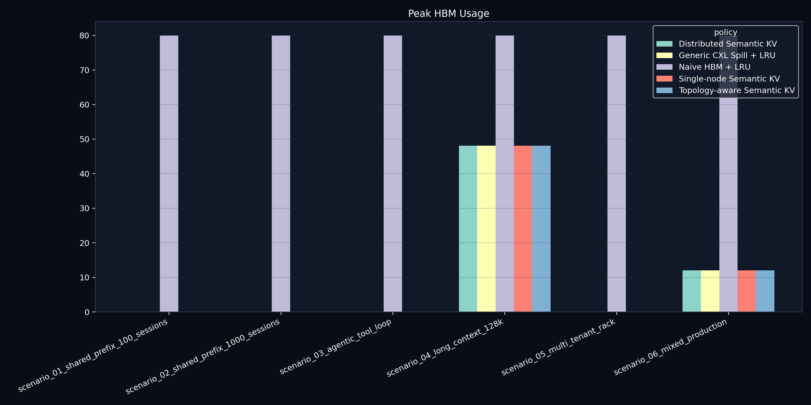
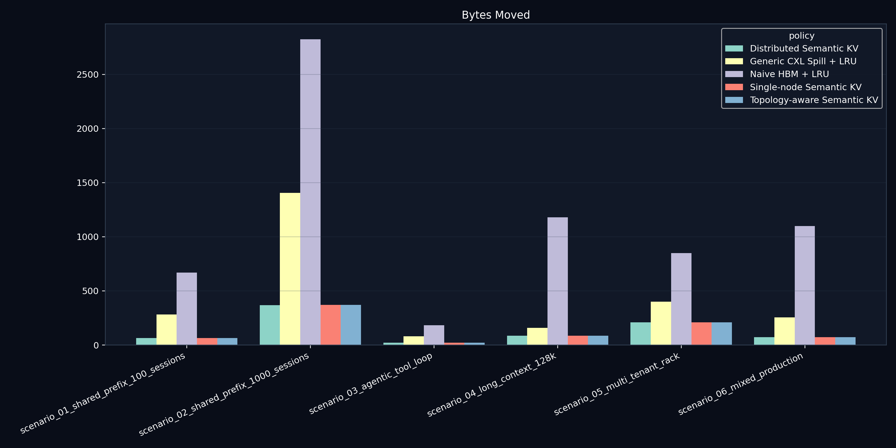
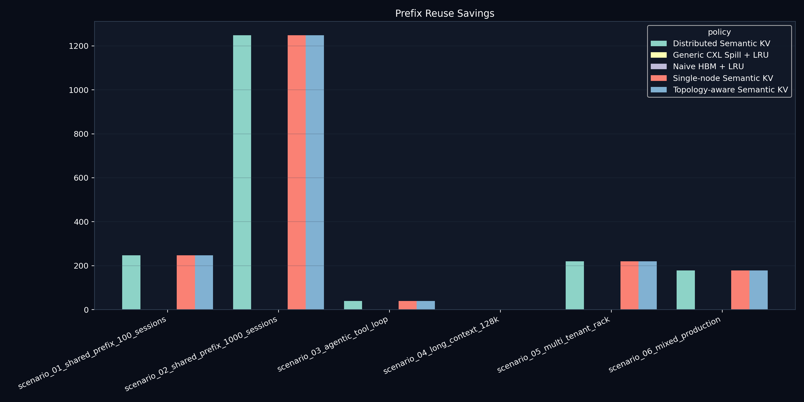
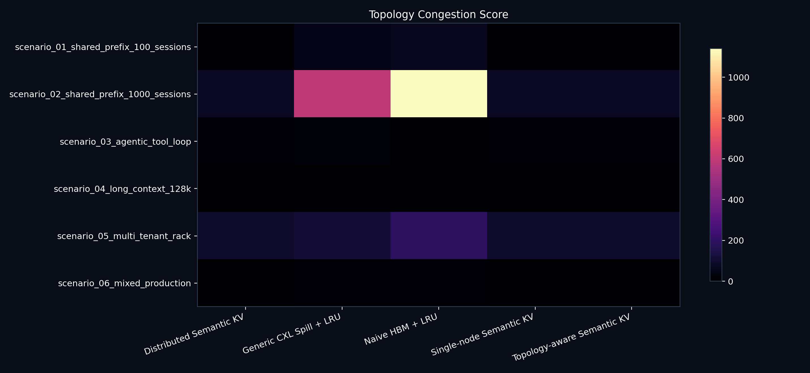
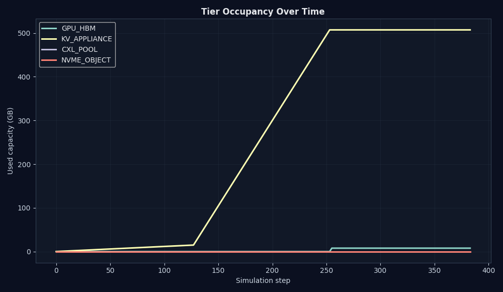
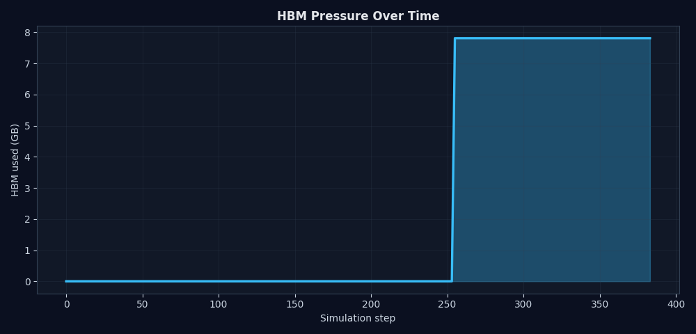
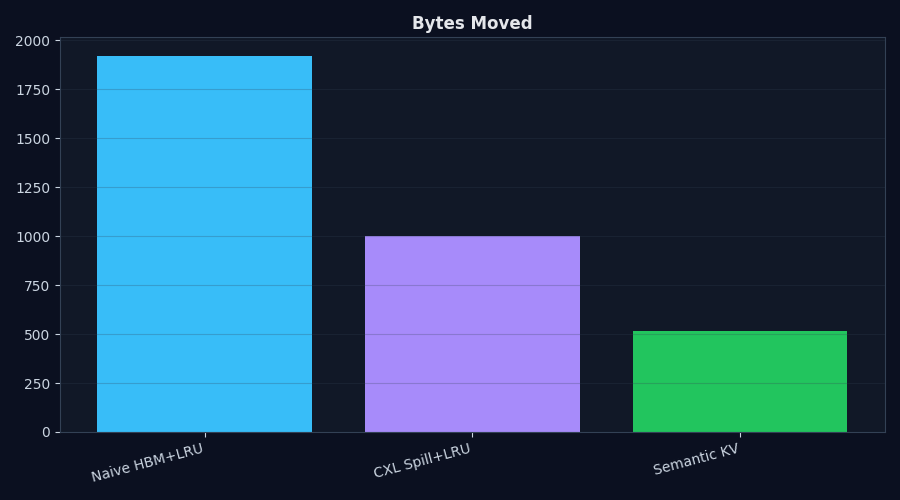
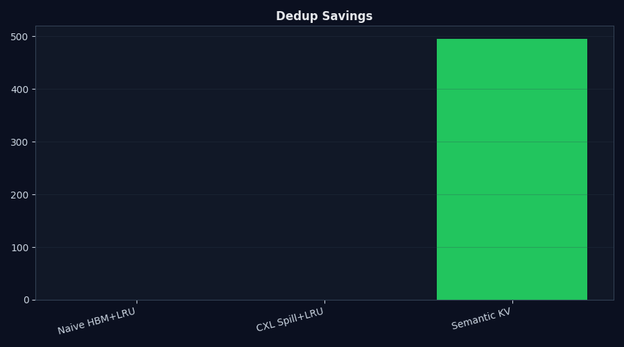
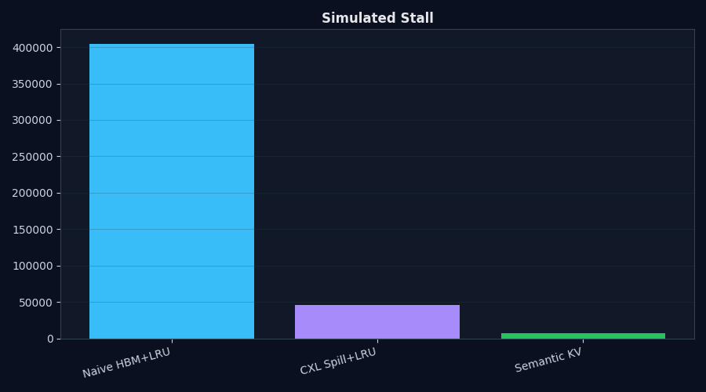
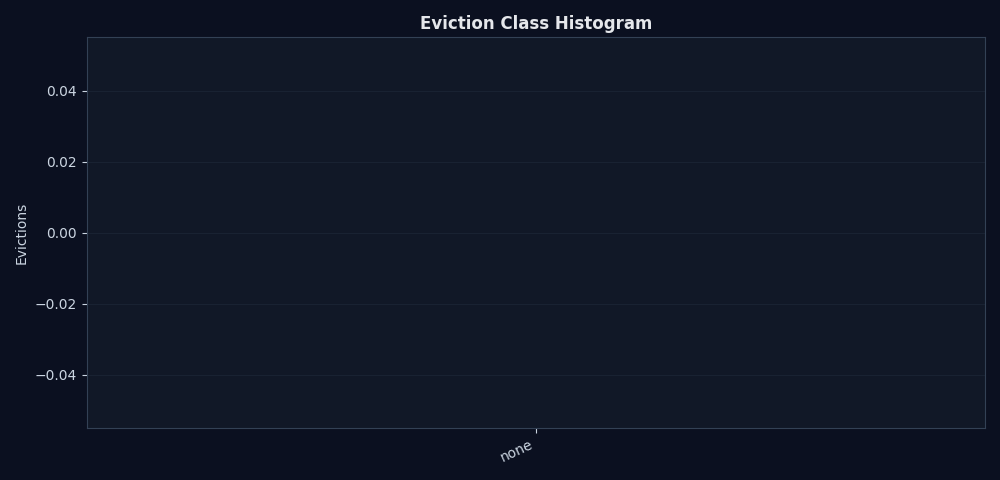

# Semantic KV Control Plane

[](https://github.com/manishklach/semantic-kv-control-plane/actions/workflows/ci.yml)
[](https://github.com/manishklach/semantic-kv-control-plane/actions/workflows/ci.yml)
[](https://www.python.org/downloads/)
[](LICENSE)

A simulator for semantic KV-cache orchestration, rack-scale memory placement, and inference memory infrastructure beyond generic CXL spillover.

Semantic KV Control Plane is a systems research prototype for studying what happens when KV cache is treated as distributed inference infrastructure rather than anonymous memory pressure. It is a simulator, not an inference engine. It does not run CUDA kernels, import real vLLM state, or claim hardware speedups.

`semantic-kv-control-plane` is an exploratory systems research platform for memory-orchestrated inference infrastructure. It models how future AI serving systems may evolve beyond generic memory spillover toward semantic KV orchestration across GPU HBM, KV appliance tiers, CXL-style memory pools, and distributed memory fabrics.

The simulator explores semantic KV metadata, topology-aware placement, rack-local and global prefix reuse, distributed semantic eviction, predictive prefetching, memory movement accounting, simulated energy/per-token costs, fabric congestion, and inference memory economics.

> **"CXL exposes memory. A KV infrastructure layer should expose intent."**

## Why This Exists

LLM serving is increasingly memory-bound. Long-context inference, high concurrency, retrieval-heavy sessions, and agentic workflows all expand KV cache footprints faster than HBM capacity grows. At the same time, many requests share structure: system prompts, developer instructions, tool schemas, agent memory, and common retrieval prefixes.

Generic spill policies can move bytes, but they do not know which bytes represent reusable prefixes, active decode state, cheap-to-recompute tool calls, or low-attention historical context. This repo explores whether semantic KV metadata could improve placement, prefetch, compression, deduplication, and eviction decisions across HBM, appliance memory, CXL pools, and persistent tiers.

## Core Thesis

KV cache should expose enough intent for infrastructure to make better movement decisions:

- active decode KV wants low latency
- shared prefixes want canonical storage and fanout-aware protection
- cold session state can tolerate pooled memory
- low-attention or recomputable blocks can be compressed or evicted earlier
- prefetch can hide some tier latency when future token ranges are predictable

This simulator explores whether semantic metadata could improve tiering and movement decisions.

The current research direction is: **what happens when inference memory becomes a distributed systems problem?**

## Repository Topics

`ai-infrastructure` · `inference` · `kv-cache` · `memory-systems` · `cxl` · `distributed-systems` · `gpu` · `hbm` · `memory-tiering` · `llm-inference` · `systems-research` · `runtime-systems` · `semantic-caching` · `topology-aware` · `prefetching` · `memory-orchestration` · `ai-systems` · `rack-scale` · `distributed-cache` · `simulation`

## Architecture Diagram

```text
                         Semantic KV Control Plane
      +----------------------------------------------------------------+
      | metadata directory | placement | eviction | prefetch | metrics |
      +----------------------------------------------------------------+
               | prefix reuse       | semantic hints        ^ telemetry
               v                    v                       |
+--------------------------+  prefetch hot blocks  +-------------------+
| GPU HBM                  | <-------------------- | Decode Runtime     |
| 80 GB · 1 us · 3000 GB/s | --------------------> | synthetic events   |
| active decode KV         |       accesses        +-------------------+
+-------------+------------+
              |
              | demote / spill / canonical prefix placement
              v
+--------------------------+  prefix refs / dedup  +-------------------+
| KV Appliance Tier        | <-------------------- | Prefix Directory  |
| 512 GB · 8 us · 800 GB/s | --------------------> | hash -> blocks    |
| reusable + recent KV     |       fanout score     +-------------------+
+-------------+------------+
              |
              | cold session state / compressed low-attention KV
              v
+--------------------------+
| CXL Memory Pool          |
| 2048 GB · 40 us · 256 GB/s
| pooled expansion memory  |
+-------------+------------+
              |
              | safe-to-recompute / persistent objects
              v
+--------------------------+
| Persistent Tier          |
| 16384 GB · 300 us · 32 GB/s
| object-style cold KV     |
+--------------------------+
```

Additional SVG diagrams:

- [KV memory hierarchy](docs/diagrams/kv_memory_hierarchy.svg)
- [Rack-scale KV fabric](docs/diagrams/rack_scale_kv_fabric.svg)
- [Topology-aware placement](docs/diagrams/topology_aware_placement.svg)
- [Semantic prefetch flow](docs/diagrams/semantic_prefetch_flow.svg)
- [Distributed prefix reuse](docs/diagrams/distributed_prefix_reuse.svg)
- [KV movement pipeline](docs/diagrams/kv_movement_pipeline.svg)
- [Distributed semantic eviction pipeline](docs/diagrams/semantic_eviction_pipeline.svg)
- [Semantic eviction flow](docs/diagrams/semantic_eviction_flow.svg)
- [Prefix reuse flow](docs/diagrams/prefix_reuse_flow.svg)
- [KV data plane](docs/diagrams/kv_data_plane.svg)
- [KV control plane](docs/diagrams/kv_control_plane.svg)

Tier capacities, bandwidths, and latencies are simplified simulation assumptions, not hardware claims.

## Comparison

| Approach | What it models well | What it does not decide by itself | How this repo treats it |
| --- | --- | --- | --- |
| Naive HBM spill | HBM-first allocation and overflow behavior | Prefix value, recompute cost, tenant/session intent | Baseline policy with LRU spill |
| Generic CXL | Larger memory capacity behind accelerators | Which KV blocks deserve fast memory | Baseline policy that places most non-hot KV in CXL |
| vLLM PagedAttention | Runtime block management for efficient serving | Cross-tier semantic orchestration as a research policy | Inspiration for block granularity, not integrated in v0.1 |
| LMCache | KV reuse/offload direction for serving systems | This repo does not replace it or benchmark against it | Related work direction; future connector mock target |
| Semantic KV orchestration | Intent-aware placement, prefix dedup, semantic eviction, simulated prefetch | Real CUDA execution or production serving | Main experimental policy in this simulator |

## Quickstart

```bash
pip install -e ".[dev]"
python -m pytest
python -m semantic_kv.cli compare --workload shared-prefix --sessions 100 --context 32768 --decode-steps 128
python benchmarks/benchmark_runner.py
python benchmarks/run_all.py
python scripts/reproduce_all.py
streamlit run dashboards/streamlit_app.py  # optional: pip install -e ".[dashboard]"
```

## Example CLI Usage

```bash
python -m semantic_kv.cli simulate --workload shared-prefix --sessions 100 --context 32768 --decode-steps 256 --policy semantic
python -m semantic_kv.cli compare --workload shared-prefix --sessions 100 --context 32768 --decode-steps 128
python -m semantic_kv.cli kv-math --model llama70b-gqa --context 32768 --sessions 100
python -m semantic_kv.cli plot --last-run outputs/results.csv
python -m semantic_kv.cli generate-trace --scenario shared-enterprise --sessions 1000
python -m semantic_kv.cli replay-trace --trace examples/traces/shared_enterprise.jsonl --policy distributed-semantic
python -m semantic_kv.cli benchmark-suite --all
python -m semantic_kv.cli generate-figures
python -m semantic_kv.cli generate-blog-assets
python -m semantic_kv.cli dashboard
```

## Example Benchmark Output

Illustrative simulation output from the shared-prefix workload:

| Policy | Peak HBM | Stored | Bytes Moved | Prefix Hit | Dedup Saved | Throughput Score |
| --- | ---: | ---: | ---: | ---: | ---: | ---: |
| Naive HBM+LRU | 80.00 GB | 1000.00 GB | 1920.00 GB | 0% | 0.00 GB | 0.12 |
| CXL Spill+LRU | 7.81 GB | 1000.00 GB | 1000.00 GB | 0% | 0.00 GB | 1.02 |
| Semantic KV | 7.81 GB | 514.80 GB | 514.80 GB | ~100% | 495.00 GB | 2.50 |

These are simulator numbers from synthetic workloads. They are useful for comparing policies inside this repo, not for claiming production speedups.

## Simulation Results

All results in this section are synthetic simulation outputs under workload assumptions. They are not real GPU, CUDA, CXL, or network measurements.

The trace replay suite defines six reproducible scenarios:

| Scenario | What it stresses |
| --- | --- |
| `scenario_01_shared_prefix_100_sessions` | enterprise prompt reuse across 100 sessions |
| `scenario_02_shared_prefix_1000_sessions` | high-fanout shared prefix reuse |
| `scenario_03_agentic_tool_loop` | ephemeral tool KV plus persistent agent memory |
| `scenario_04_long_context_128k` | few very long contexts |
| `scenario_05_multi_tenant_rack` | tenant-scoped prefixes on rack topology |
| `scenario_06_mixed_production` | blended enterprise, agentic, and long-context pressure |

Example generated findings:

- Under the 100-session shared-prefix simulation, Distributed Semantic KV reduced peak HBM pressure from 80.00 GB to 0.00 GB in this synthetic setup, because shared and recent blocks were placed outside HBM rather than modeled as active decode blocks.
- Prefix reuse avoided 247.50 GB of duplicate KV residency in the 100-session shared-prefix scenario and 1248.75 GB in the 1000-session scenario.
- Distributed prefix accounting modeled 247.50 GB of avoided cross-rack movement in the 100-session shared-prefix scenario and 1248.75 GB in the 1000-session scenario.
- Memory movement fell from 482.50 GB to 38.70 GB in the 100-session shared-prefix scenario under Distributed Semantic KV versus Naive HBM + LRU.
- In these synthetic scenarios, topology-aware policies can trade lower movement for a higher congestion/stall proxy when appliance placement becomes overloaded; this is a policy signal, not a hardware result.

Generated result artifacts:

- `benchmarks/results/scenario_results.csv`
- `benchmarks/results/scenario_results.json`
- `benchmarks/results/scenario_summary.md`
- `benchmarks/results/scenario_findings.md`
- `outputs/paper_figures/`
- `outputs/blog/`

Reproduce the evidence package:

```bash
python scripts/reproduce_all.py
```

Selected generated figures:






## Visuals

After running `compare`, plots are written to `outputs/plots/` and a static dashboard is written to `outputs/dashboard.html`.








## Benchmark Harness

`benchmarks/benchmark_runner.py` runs all policies across:

- `shared-prefix`
- `long-context`
- `agentic-workflow`
- `multi-tenant-inference`
- `shared-enterprise-prompt`
- `multi-agent-collaboration`

It compares:

- `NaiveHBMPolicy`
- `CXLSpillPolicy`
- `SemanticSingleNode`
- `TopologyAwareSemantic`
- `DistributedSemanticKV`

It writes:

- `benchmarks/results/benchmark_results.csv`
- `benchmarks/results/benchmark_summary.md`
- aggregate policy plots under `benchmarks/results/plots/`

Distributed metrics include avoided movement, multicast savings, avoided cross-rack bytes, energy per token, and topology congestion score.

## Trace Support

`src/semantic_kv/traces.py` defines a lightweight trace abstraction with `KV_ALLOC`, `KV_ACCESS`, `KV_PREFETCH`, `KV_EVICT`, `SESSION_START`, and `SESSION_END`. It is intended as the seam for future vLLM trace replay and imported serving traces.

Trace replay now supports additional synthetic event types including prefix lookups/hits/misses, tool-call boundaries, tenant switches, and decode steps. Sample traces are generated under `examples/traces/`.

## Ecosystem Context

See [docs/ecosystem_context.md](docs/ecosystem_context.md) for a grounded comparison with vLLM PagedAttention/prefix caching, TensorRT-LLM KV reuse, LMCache, SGLang/Mooncake-style distributed serving, and CXL memory expansion. This project explores a complementary abstraction layer.

## Limitations

- Simulation only
- No real CUDA execution
- No real vLLM integration yet
- No TensorRT-LLM or LMCache connector yet
- Synthetic workloads only in v0.1
- Simplified latency, bandwidth, and queue-depth models
- Simplified rack and fabric topology
- Energy model is illustrative and relative
- Compression is ratio-only; no tensor quality validation
- Prefix reuse is exact-match hash simulation

## Future Work

- vLLM trace import and replay
- TensorRT-LLM integration experiments
- DPU/FPGA offload simulation for metadata and movement scheduling
- Topology-aware placement across multi-GPU and rack-scale memory fabrics
- Semantic multicast for shared prefix distribution
- KV-aware NIC concepts
- LMCache/vLLM connector mock
- More realistic workload traces and tenant isolation policies
