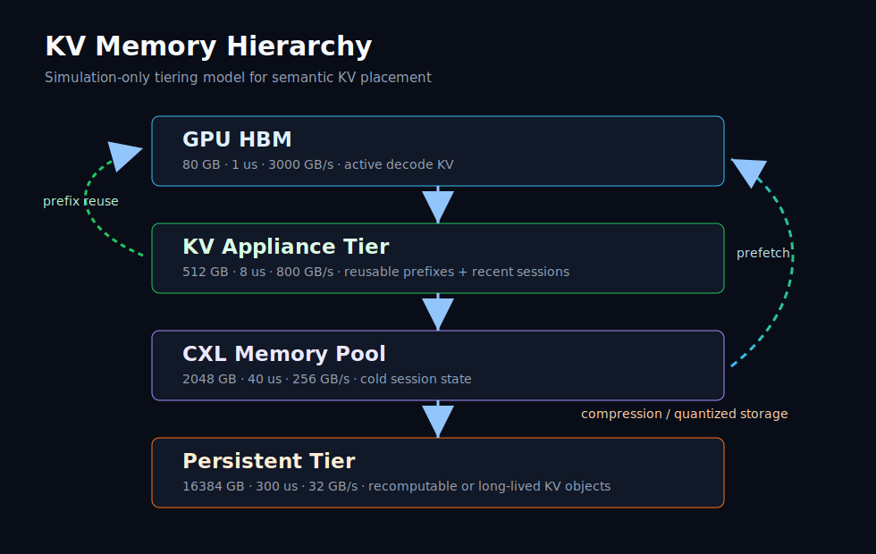
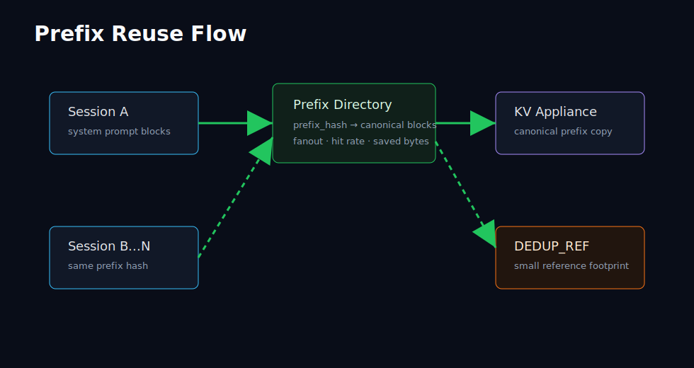
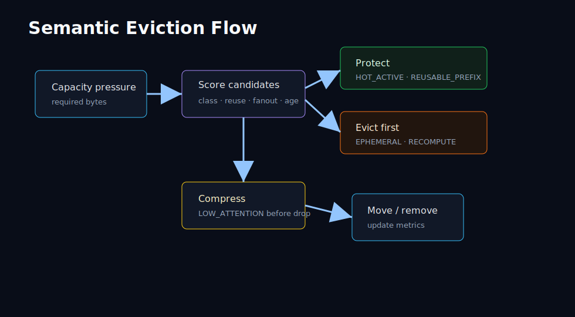
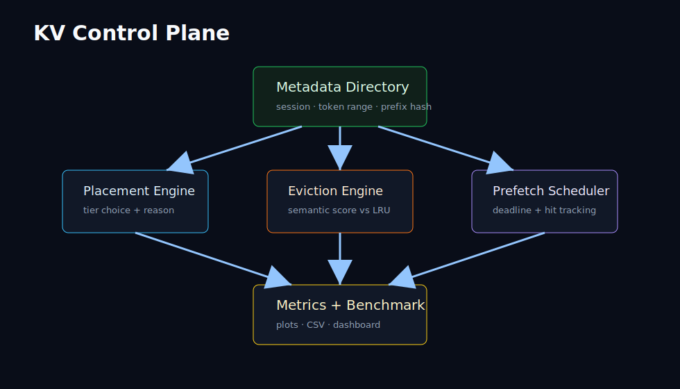
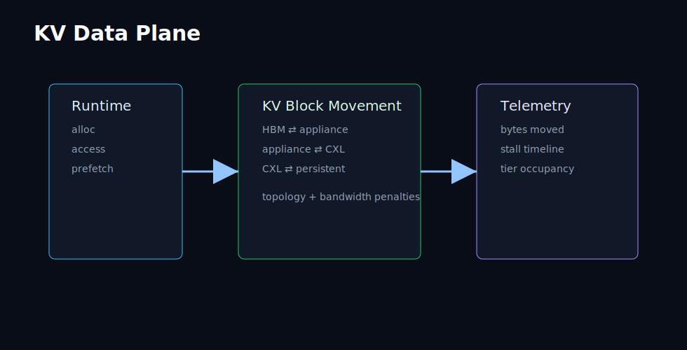
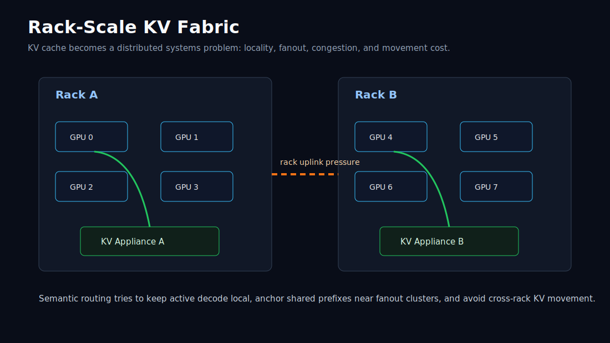
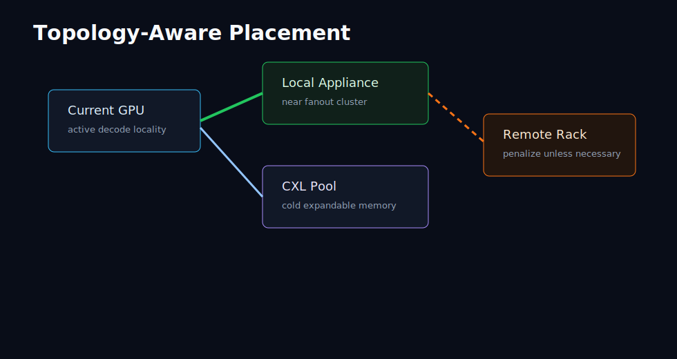
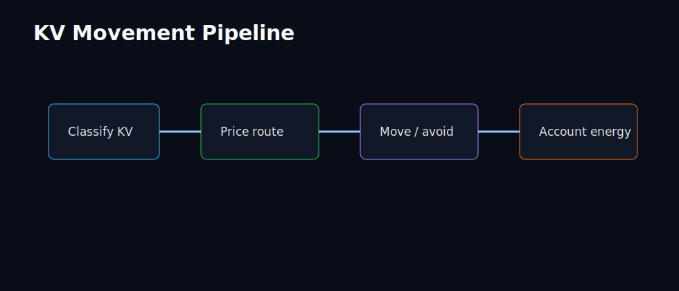

# Architecture

Semantic KV Control Plane models KV cache as intent-rich infrastructure instead of anonymous memory pages. The implementation is intentionally simulator-first: policies operate on metadata-rich `KVBlock` objects and simulated memory tiers, not real tensors.

## Active Decode Working Set

The current simulator explicitly reserves part of GPU HBM for decode-hot state.
`ActiveDecodeWindow`, `DecodeResidencyTracker`, and `HBMReservationManager`
work together to model a simple but important truth: even in a distributed KV
fabric, some fraction of the active decode window must stay resident in the hot
tier.

This active-HBM floor avoids unrealistic outcomes where every meaningful byte
gets pushed to slower memory while decode is still in flight.

## Tiers

GPU HBM is the active decode tier with the lowest simulated latency and tightest capacity. KV appliance memory represents a dedicated service tier for reusable prefixes and recent session state. CXL pool memory represents large pooled expansion memory with higher latency. NVMe object storage represents a persistent tier for cold or cheap-to-recompute KV.

## Metadata Directory

The metadata directory tracks prefix hashes, canonical KV blocks, attached sessions, fanout, and reuse savings. This lets a shared system prompt be modeled as one canonical set of blocks plus references.

## Prefix Dedup

Prefix dedup is exact-match only in v0.1. The simulator stores canonical prefix KV once, then turns later matching blocks into `DEDUP_REF` entries with a small simulated storage footprint.

The platform also includes optional approximate structural matching via MinHash.
That mode captures near-identical prompt structure under small token edits, but
it is intentionally not presented as embedding-based semantic search.

## Prefetch Scheduler

The prefetch scheduler predicts a simple next-token window and tracks requests, hits, late prefetches, success rate, and avoided stall time.

## Heat And Attention

Later revisions add a lightweight heat model and attention-aware importance
estimator. Blocks now cool over time, carry predicted reuse windows, and can be
treated as more compressible or recomputable when their modeled attention value
falls.

This matters because not all KV competes equally for scarce HBM residency.

## Semantic Eviction

Semantic eviction scores blocks using eviction class, reuse score, fanout, prefix presence, last access, recompute cost, and tier. It protects hot active and reusable prefix blocks while preferring ephemeral and cheap-to-recompute blocks as victims.

## Control Plane And Data Plane

The control plane chooses where KV should live and why. The data plane simulation records bytes moved, stall accumulation, bandwidth saturation events, and occupancy over time.

## Rack-Scale Fabric

The rack-scale model adds GPU nodes, appliance affinity, rack IDs, CXL pools,
uplinks, cross-rack links, congestion penalties, and topology-aware placement
decisions.

The newer topology model represents a weighted graph with:

- NVLink islands
- PCIe trees
- rack-local domains
- oversubscribed leaf-spine links
- route-specific congestion accumulation
- ECMP-style path selection heuristics

## Movement Pipeline

Movement accounting tracks bytes moved, avoided movement, multicast savings, avoided cross-rack traffic, and an illustrative movement-energy estimate.

## Failures And Degraded Modes

The simulator now includes synthetic failure and degradation hooks for
appliance failure, hot-tier overload, congestion collapse, and emergency spill
behavior. These are not hardware fault models; they are control-plane stressors
used to ask whether a placement strategy stays coherent under pressure.

## Runtime-Shaped Traces

Synthetic traces remain the default input format, but the repo now includes
mock runtime-shaped connectors for `vLLM`, `TensorRT-LLM`, and `LMCache`. Their
purpose is not live integration. Their purpose is to normalize runtime-like
events into the common trace schema so policy experiments can move toward
serving-shaped inputs over time.
